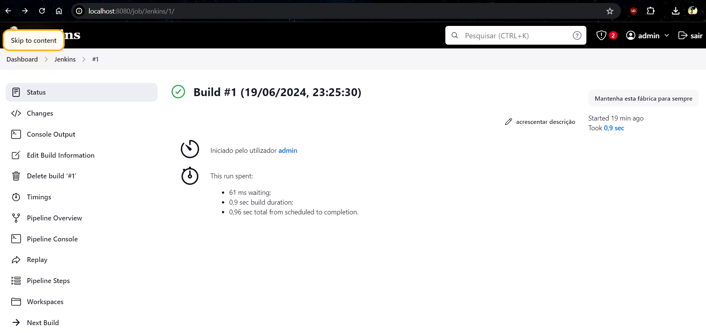

<strong>Repository:</strong> devops-23-24-JPE-PSM-1231831
 <p></p>

# Class Assignment 5

<p></p>

<strong>Student: </strong>
Inês Guedes
 <p></p>

<strong>Number:</strong>
1231831
<p></p>

<p>
</p>
<p></p>

## Introduction
<p></p>

In the DevOps class we were challenged to work set up a CI/CD pipeline using Jenkins by using the ”gradle basic demo” project.
In the first part of the project, we're supposed to create a pipeline that will be responsible for checking out, assembling, testing and creating an archive artifact. 
In the second pipeline, besides the functions of the first pipeline, it is supposed to generate JavaDoc and generate a Docker image.
<p></p>
<p></p>

## Tutorial - Installation and Step up of Jenkins
<p></p>
Firstly, to begin with the project, by following the instructions in the official Jenkins website, I downloaded the 2.452.2 version of Jenkins 
on a Windows in my local machine. When downloading it I set it up and tested the port to be 8080.
<p></p>
Then, I went to the directory where the Jenkins WAR file is located, and by running it up in the terminal, I specified the HTTP port:
<p></p>

```bash
java -jar jenkins.war --httpPort=8080
```

<p></p>
After that, I accessed the Jenkins dashboard by typing in the browser the URL: http://localhost:8080/ and I was prompted to enter the initial password
that was already given by following the Jenkins tutorial and by writting it on the terminal:
<p></p>

```bash
java -jar jenkins.war
```

<p></p>
Once the password was entered, I installed the suggested plugins and created an admin user. The plugins were: 
<p></p>

* Docker API;
* Docker Commons;
* Docker Pipeline;
* Docker;
* Docker-build-step;
* HTML Publisher.

<p></p>
The next step was to create a new item, which in this case was a pipeline, and I named it "Jenkins".
<p></p>
When setting up the pipeline, I chose the option "Pipeline script from SCM", and set the SCM to Git, with my repository URL and the repository's branch name ("main"), as well as the path to the Jenkinsfile.
<p></p>
As asked in the project, I created a Jenkinsfile in the root of the project,that included a script with stages for checking out the code, building the project, running tests, and archiving the artifacts:
<p></p>

```bash
pipeline {
agent any
stages {
    stage('Checkout') {
            steps {
                echo 'Checking out the code from the repository'
                git branch: 'main', url: 'https://github.com/Departamento-de-Engenharia-Informatica/devops-23-24-JPE-1231831.git'
            }
        }
    stage('Assemble') {
            steps {
                echo 'Assembling...'
                dir('CA2/Part1/gradle_basic_demo') {
                     sh 'chmod +x ./gradlew'
                     sh './gradlew clean assemble'
                }
            }
        }
    stage('Test') {
            steps {
                echo 'Testing...'
                dir('CA2/Part1/gradle_basic_demo') {
                    sh './gradlew test'
                    junit 'build/test-results/test/*.xml'
                }
            }
        }
    stage('Archive') {
            steps {
                echo 'Archiving...'
                dir('CA2/Part1/gradle_basic_demo') {
                    archiveArtifacts 'build/libs/*.jar'
                }
            }
        }
    }
}
```

<p></p>
After that, I saved the pipeline and ran it. The built of the pipeline was successful as it is shown in the following image:
<p></p>
<p></p>

)

<p></p>
<p></p>

## Pipeline - Jenkins with SpringBoot

<p></p>
<p></p>

For this part I wrote another pipeline, but this time the script will push the Docker image onto the DockerHub:

 <p></p>
 
```bash

pipeline {
    agent any

    environment {
        DOCKER_CREDENTIALS_ID = 'docker-hub-credentials'
        DOCKER_IMAGE = '1231831/ca2image'
        DOCKER_TAG = "${env.BUILD_ID}"
    }

    stages {
        stage('Checkout') {
             steps {
                 echo 'Checking out code from the repository'
                 git branch: 'main', url: 'https://github.com/simao-campos87/devops-23-24-JPE-1231859.git](https://github.com/Departamento-de-Engenharia-Informatica/devops-23-24-JPE-1231831.git'
               }
        }

        stage('Set Permissions') {
            steps {
                dir('CA2/Part2/react-and-spring-data-rest-basic') {
                    echo 'Setting executable permissions on gradlew...'
                    sh 'chmod +x gradlew'
                }
            }
        }

        stage('Assemble') {
            steps {
                retry(3) {
                    dir('CA2/Part2/react-and-spring-data-rest-basic') {
                        echo 'Assembling the application...'
                        sh './gradlew assemble'
                    }
                }
            }
        }

        stage('Test') {
            steps {
                dir('CA2/Part2/react-and-spring-data-rest-basic') {
                    echo 'Running unit tests...'
                    sh './gradlew test'
                }
            }
        }

        stage('Javadoc') {
            steps {
                dir('CA2/Part2/react-and-spring-data-rest-basic') {
                    echo 'Generating Javadoc...'
                    sh './gradlew javadoc'
                    publishHTML(target: [
                        allowMissing: false,
                        alwaysLinkToLastBuild: false,
                        keepAll: true,
                        reportDir: 'build/docs/javadoc',
                        reportFiles: 'index.html',
                        reportName: 'Javadoc'
                    ])
                }
            }
        }

        stage('Archive') {
            steps {
                dir('CA2/Part2/react-and-spring-data-rest-basic') {
                    echo 'Archiving artifacts...'
                    archiveArtifacts artifacts: 'build/libs/*.jar', fingerprint: true
                }
            }
        }

        stage('Create Dockerfile') {
            steps {
                dir('CA2/Part2/react-and-spring-data-rest-basic') {
                    script {
                        def dockerfileContent = """
                        FROM gradle:jdk21
                        WORKDIR /app
                        COPY build/libs/*.jar app.jar
                        EXPOSE 8080
                        ENTRYPOINT ["java", "-jar", "app.jar"]
                        """
                        writeFile file: 'Dockerfile', text: dockerfileContent
                    }
                }
            }
        }

        stage('Publish Image') {
            steps {
                script {
                    echo 'Building and publishing Docker image...'
                    docker.withRegistry('https://index.docker.io/v1/', "${DOCKER_CREDENTIALS_ID}") {
                        dir('CA2/Part2/react-and-spring-data-rest-basic') {
                            def customImage = docker.build("${DOCKER_IMAGE}:${DOCKER_TAG}")
                            customImage.push()
                            customImage.push('latest')
                        }
                    }
                }
            }
        }

        stage('Run Container') {
            steps {
                script {
                    echo 'Running Docker container...'
                    sh "docker run -d -p 8080:8080 ${DOCKER_IMAGE}:latest"
                }
            }
        }
    }
}

```
c

 Afterwards, with the intent of running the Docker image, I pulled the image from the Docker Hub and ran it:
<p></p>
 
 ```bash
 pull 1231831/ca2image
run -p 8080:8080 1231831/ca2image
 ```

<p><</p>
 Finally, I could access the image by using the latest pre-defined port (http://localhost:8080).
